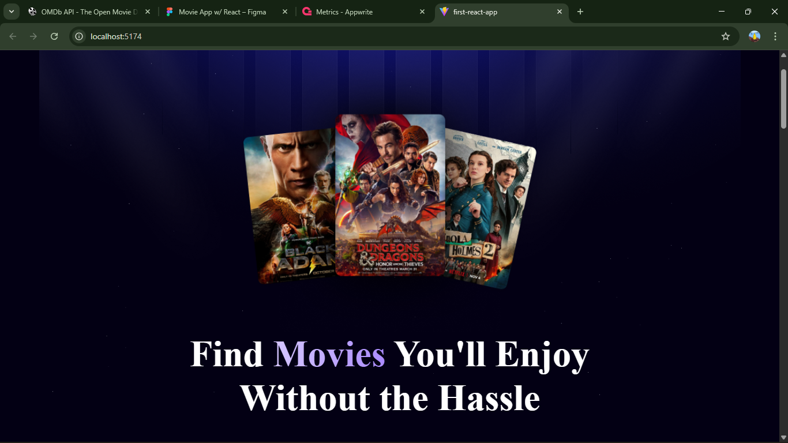
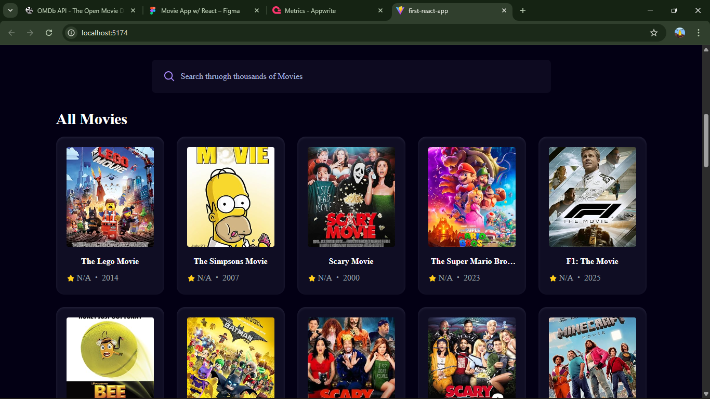
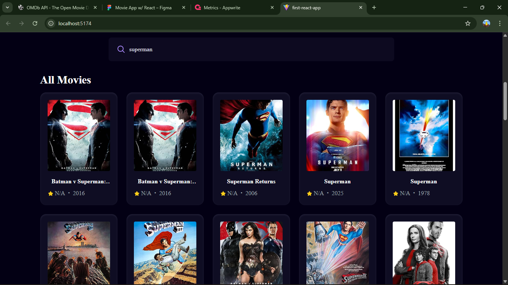

# Movie Finder App

## A responsive React application that allows users to search for movies, and explore movie details effortlessly. Built with **React**, **Vite**, **TailwindCSS**.

## Table of Contents

 
- [Features](#features)
- [Technologies](#technologies)
- [Getting Started](#getting-started)

<<<<<<< HEAD
---
## 🌐 Live Demo
👉 [View the Live App](https://JaredGezahegn.github.io/movie_react_app)

## Demo

### Homepage


### All Movies


### Search Function



---
=======
 
>>>>>>> 368907571e15e28ab814baefc18aa93850f5a479

## Features

- Search movies using the [OMDB API](http://www.omdbapi.com/).
- See Movie detail for any movie.
- Debounced search for better performance.
- Responsive design with TailwindCSS.
- Movie cards display poster, title, and year.
- Handles API errors gracefully with user-friendly messages.

---

## Technologies

- **Frontend:** React, Vite, TailwindCSS
- **State Management:** React Hooks (useState, useEffect)
- **API:** OMDB API
- **Utilities:** Lodash for debouncing

---

## Getting Started

### Prerequisites

- Node.js >= 18
- npm >= 9

### Installation

1. Clone the repository:

```bash
git clone https://github.com/JaredGezahegn/movie_react_app.git
cd movie-finder-app
```
